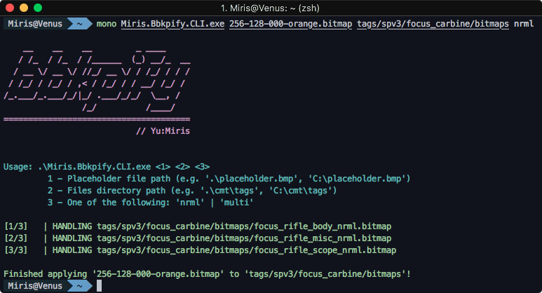

<html>
    <p align="center">
        
    </p>
    <h1 align="center">bbkpify</h1>
    <p align="center">
        Safely replace Sapien texture bitmaps with placeholders.
        <br>
        <br>
        <a href="https://github.com/yumiris/bbkpify/releases/latest">Download</a>
    </p>
</html>

# About

Sapien occasionally runs out of memory when large texture bitmaps are used.
To avoid that, one can use placeholder bitmaps which are insignificant in size.

This tool replaces all `nrml` or `multi` bitmaps in a provided directory with a given placeholder file.
The original bitmaps are backed up, thus making the process completely safe and reversible.

# Usage

```ps
.\YuMi.Bbkpify.CLI.exe <1> <2> <3>
                        |   |   |
                        |   |   +- Placeholder bitmap path (e.g. 'placeholder.bmp')
                        |   +----- Bitmaps directory path (e.g. 'cmt\tags')
                        +--------- One of the following: 'nrml' | 'multi'

.\YuMi.Unbbkpify.CLI.exe <1>
                          |
                          +- Directory path with bbkp bitmaps (e.g. 'cmt\tags')
```
