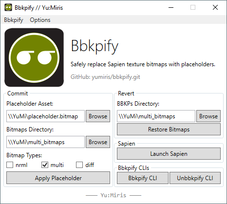

<html>
    <p align="center">
        
    </p>
    <h1 align="center">bbkpify</h1>
    <p align="center">
        Safely replace Sapien texture bitmaps with placeholders.
        <br>
        <br>
        <a href="https://github.com/yumiris/bbkpify/releases/latest">Download</a>
    </p>
</html>

# About

Sapien occasionally runs out of memory when large texture bitmaps are used.
To avoid that, one can use placeholder bitmaps which are insignificant in size.

This tool replaces bitmaps in a provided directory with a given placeholder file.
The following bitmap types are supported:

- `nrml`
- `multi`
- `diff`


The original bitmaps are backed up, thus making the process completely safe and reversible.

# GUI



- The left side of the GUI deals with applying (committing) a placeholder bitmap to a given directory.
- The right side handles the restoring (reverting) of the said process. Additionally, it also offers the ability to load
  Sapien and the Bbkpify CLIs.

# CLI

```ps
.\YuMi.Bbkpify.CLI.exe <1> <2> <3>
                        |   |   |
                        |   |   +- Placeholder bitmap path (e.g. 'placeholder.bmp')
                        |   +----- Bitmaps directory path (e.g. 'cmt\tags')
                        +--------- One of the following: 'nrml' | 'multi' | 'diff'

.\YuMi.Unbbkpify.CLI.exe <1>
                          |
                          +- Directory path with bbkp bitmaps (e.g. 'cmt\tags')
```
