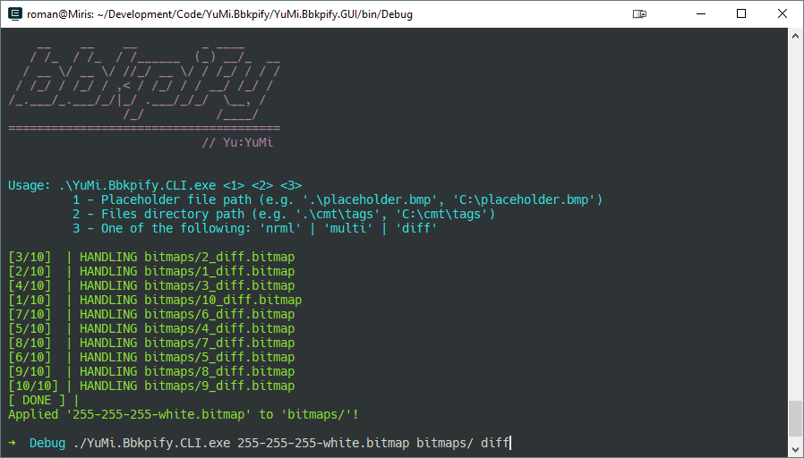

<html>
    <p align="center">
        
    </p>
    <h1 align="center">bbkpify</h1>
    <p align="center">
        Safely replace Sapien texture bitmaps with placeholders.
        <br>
        <br>
        <a href="https://github.com/yumiris/bbkpify/releases/latest">Download</a>
    </p>
</html>

# About

Sapien occasionally runs out of memory when large texture bitmaps are used.
To avoid that, one can use placeholder bitmaps which are insignificant in size.

This tool replaces bitmaps in a provided directory with a given placeholder file.
The following bitmap types are supported:

- `nrml`
- `multi`
- `diff`

The original bitmaps are backed up, thus making the process completely safe and reversible.

## CLI



The program is powered by two CLI programs:

| CLI | Description |
| --- | ----------- |
| `YuMi.Bbkpify.CLI.exe` | Applies a given placeholder to a given bitmaps directory |
| `YuMi.Unbbkpify.CLI.exe` | Restores the original bitmaps from BBKPs in a given bitmaps directory |

Both CLIs are cross-platform programs which handle the bitmaps in parallel. Both programs can be ran either through:

- startup arguments, which facilitates easy scripting or interfacing to front-end GUIs;
- interactive arguments, which allows the user to provide the requested arguments.

```ps
.\YuMi.Bbkpify.CLI.exe <1> <2> <3>
                        |   |   |
                        |   |   +- Placeholder bitmap path (e.g. 'placeholder.bmp')
                        |   +----- Bitmaps directory path (e.g. 'cmt\tags')
                        +--------- One of the following: 'nrml' | 'multi' | 'diff'

.\YuMi.Unbbkpify.CLI.exe <1>
                          |
                          +- Directory path with bbkp bitmaps (e.g. 'cmt\tags')
```
